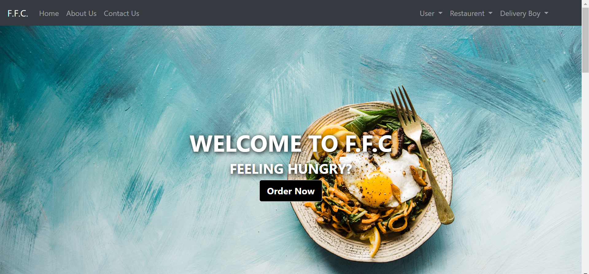
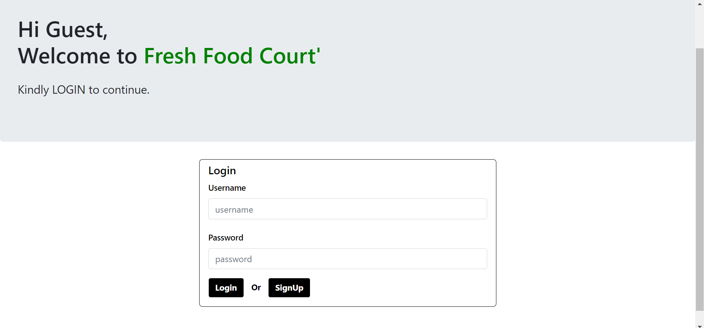
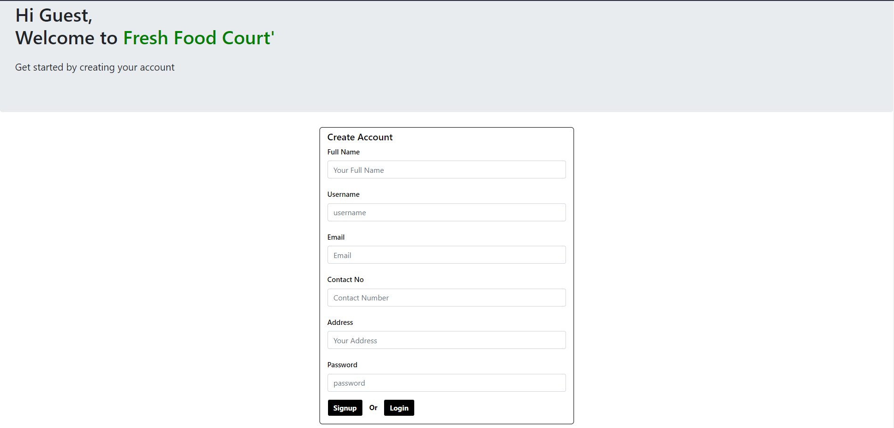
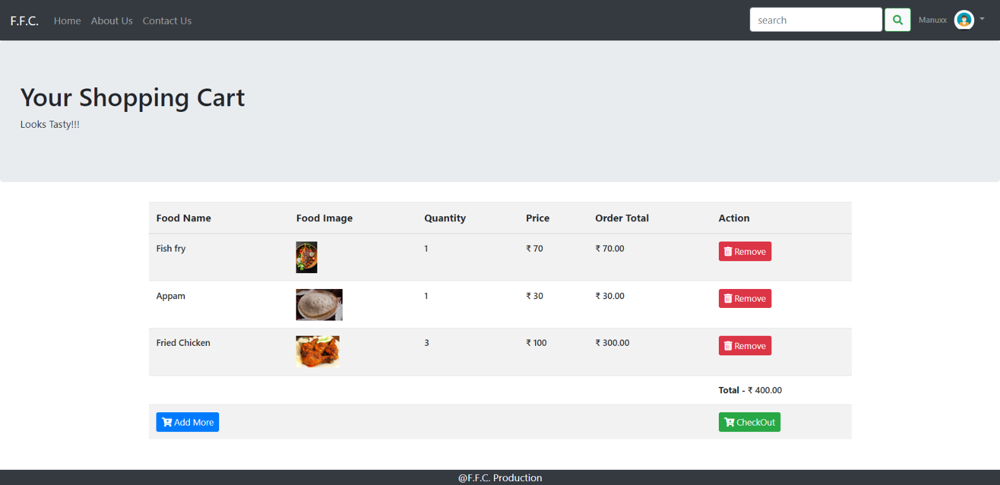
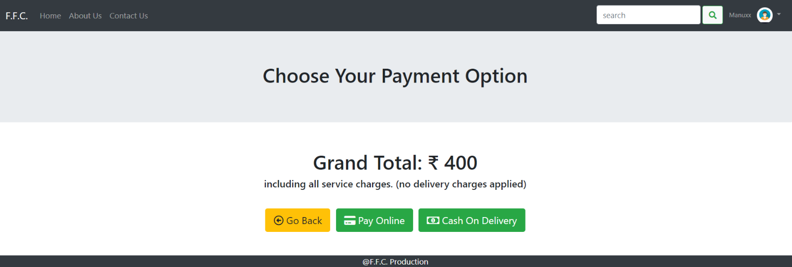
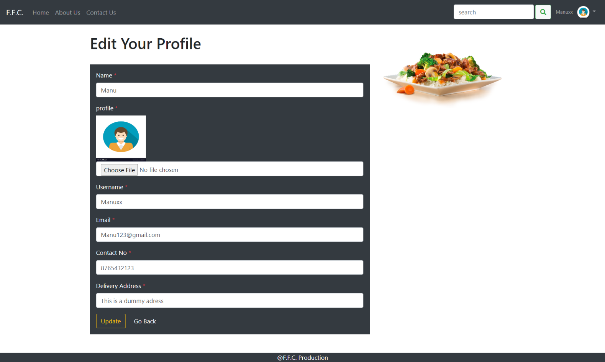

# FFC - Fresh Food Court 
### An online food ordering web application project using HTML, CSS, PHP, BOOTSRAP, JAVASCRIPT. 

A web application designed by Akhil R Nadh (Trick Trendz), for online food ordering and management.

### About this project

FFC (Fresh Food Court) was our degree final year project where our main idea is to build a food ordering web application that looks more realistic with multiple functionalities and contain most of the features that a normal real time application have.

Since it's our degree final year project, we have implemented different modules to the project to make it bigger and better. Having different modules gives our project a lot to explain and score good marks out of it. In fact I got excellent marks for creating this project and the way I have presented and explained this project to the examiner.

I hope by sharing this project online will help you to understand how I build this project and also will help students to learn something out of it.

### Abstract

Online food ordering system called FFC greatly simplifies the ordering process for both the customer and the restaurant. System presents an interactive and up-to-date menu with all available options in an easy to use manner. Customer can choose one or more items to place an order which will land in the cart. Customers can view all the order details in the cart before checking out. At the end, customer gets order confirmation details. Once the order is placed it is entered in the database and retrieved in pretty much real time. This allows Restaurent Employees to quickly go through the orders as they are received and process all orders effectively and efficiently with minimal delays and confusion.

### Modules in this Project
-----
1. Admin

2. Restaurent Managers

3. Customers

4. Delivery Boys

### Tools Used
-----
1. Visual Studio Code

2. Xaamp

### Project Screenshot
------------

1. Home page

<ul>
   
</ul>

2. Customer / User

<ul>
   <li>
      Login
   </li>
   
   <li>
      Registration
   </li>
   
   <li>
      User Dashboard
   </li>
   
   <li>
      Cart Section
   </li>
   
   <li>
      Payment
   </li>
   
   <li>
      Profile
   </li>
   
   <li>
      Live Tracking
   </li>
   
</ul>

3. Restaurent Login

<ul>
<li>
Registration
</li>
<li>
Login
</li>
<li>
Dashboard
</li>
</ul>

